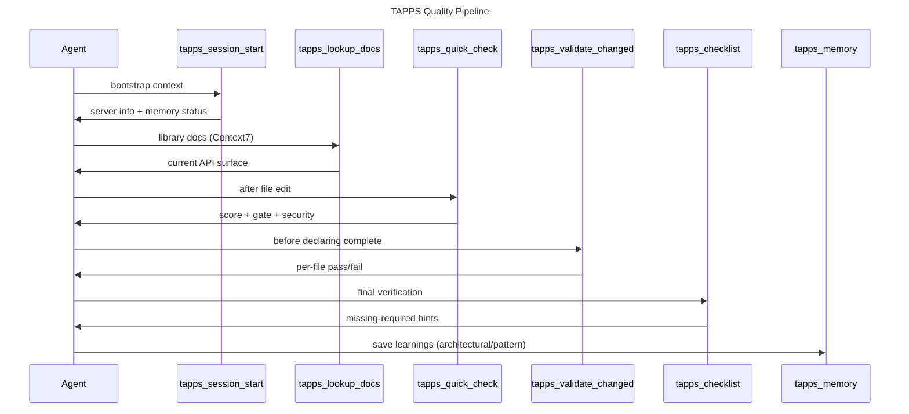
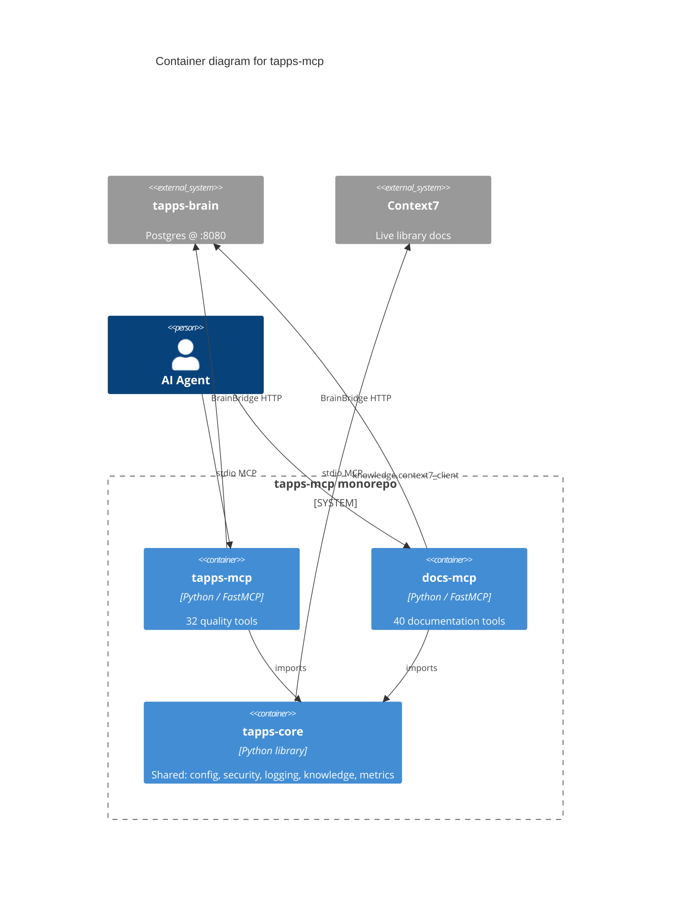

# TappsMCP Architecture Reference

Detailed internal architecture for developers working on TappsMCP itself.
For quick-start guidance, see [CLAUDE.md](../CLAUDE.md).

## Package dependency graph

```
tapps-brain (standalone library - memory system)
    ^
    |
tapps-core (shared infrastructure)
    ^              ^
    |              |
tapps-mcp      docs-mcp
(35 tools)     (40 tools)
```

**tapps-brain** is the standalone memory service extracted from tapps-core. It runs as a Dockerized PostgreSQL-backed service. tapps-mcp accesses it through `BrainBridge`, which supports two transports — **in-process** (default; see [ADR-0001](adr/0001-in-process-agentbrain-via-brainbridge.md)) and **HTTP** (selected automatically when `memory.brain_http_url` is set in `.tapps-mcp.yaml`, e.g. `http://localhost:8080`). Both modes share the same circuit-breaker / offline-queue / version-floor logic. Persistence engine, retrieval (BM25 + boosts), time-based decay, contradiction detection, consolidation, federation, and GC all live in the [tapps-brain repo](https://github.com/wtthornton/tapps-brain) — refer there for the authoritative description. tapps-brain has its own repository, release cycle, and test suite.

Shared infrastructure (config, security, logging, knowledge, experts, metrics, adaptive) lives in `tapps-core`. Both MCP servers depend on it. Server files in tapps-mcp import from `tapps_core` directly for extracted packages.

tapps-core's `memory/` package contains thin re-export shims delegating to tapps-brain. The one exception is `injection.py`, a bridge adapter that reads TappsMCP settings and constructs tapps-brain's `InjectionConfig`. Imports from `tapps_core.memory.*` emit a `DeprecationWarning` pointing users to `tapps_brain.*` directly.

## Server module split (tapps-mcp)

The MCP server is split across ten files (server.py + 9 modules) sharing the same `mcp` FastMCP instance created in `server.py`:

- **`server.py`** -- Creates the `FastMCP("TappsMCP")` instance and 5 core tools (`tapps_server_info`, `tapps_security_scan`, `tapps_lookup_docs`, `tapps_validate_config`, `tapps_checklist`). Imports the other modules which register their tools/resources on the shared `mcp` object.
- **`server_scoring_tools.py`** -- `tapps_score_file`, `tapps_quality_gate`, `tapps_quick_check`
- **`server_pipeline_tools.py`** -- `tapps_validate_changed`, `tapps_session_start`, `tapps_init`, `tapps_set_engagement_level`, `tapps_upgrade`, `tapps_doctor`, `tapps_pipeline`, `tapps_decompose`
- **`server_metrics_tools.py`** -- `tapps_dashboard`, `tapps_stats`, `tapps_feedback`
- **`server_memory_tools.py`** -- `tapps_memory` (42 actions)
- **`server_analysis_tools.py`** -- `tapps_session_notes`, `tapps_impact_analysis`, `tapps_report`, `tapps_dead_code`, `tapps_dependency_scan`, `tapps_dependency_graph`, `tapps_audit_campaign`
- **`server_linear_tools.py`** -- `tapps_linear_snapshot_get`, `tapps_linear_snapshot_put`, `tapps_linear_snapshot_invalidate`, `tapps_linear_count` (cache-first Linear read path; see [`.claude/rules/linear-standards.md`](../.claude/rules/linear-standards.md))
- **`server_release_tools.py`** -- `tapps_release_update` (builds release-update payload for the `linear-release-update` skill)
- **`server_resources.py`** -- MCP resources (knowledge, config) and prompts (pipeline, workflow)
- **`server_helpers.py`** -- Shared utilities: `emit_ctx_info()`, response builders, singleton caches

## NLT MCP server registration (ADR-0016)

`tapps-mcp` exposes tools through **needs-based NLT profiles** — enable 1–3 servers per session, not all six. Legacy `--profile nlt-code-quality` maps to **Build**; `nlt-platform-admin` maps to **Setup** for one release.

| MCP server ID | CLI profile | Eager tools (approx) | Purpose |
|---|---|---|---|
| `nlt-build` | Build | 9 | Score, gate, validate, docs lookup, impact graph |
| `nlt-memory` | Memory | 2 | Slim `tapps_memory` + session handoff |
| `nlt-setup` | Setup | 2 | init, upgrade, doctor, engagement |
| `nlt-linear-issues` | (situational) | — | Linear cache-first reads / writes |
| `nlt-project-docs` | (situational) | — | Doc generation and drift audit |
| `nlt-release-ship` | (situational) | — | Release notes / ship gate |

**Default bundle after `tapps_init`:** `full` = all six `nlt-*` servers ([ADR-0018](adr/0018-deploy-all-six-nlt-mcp-servers-by-default.md)). Opt down with `--bundle developer` (Build + Memory + Linear, ~18 eager) or `--bundle minimal` (build-only).

**Key contract:** identical tool names on enabled servers refer to identical implementations — the NLT split is about **which tools the client sees**, not different handler code. Prefer `mcp__nlt-build__tapps_*` in generated skills when Build is always enabled.

The same pattern applies to `docs-mcp` situational servers. See [docs/adr/0016-needs-based-nlt-mcp-taxonomy.md](adr/0016-needs-based-nlt-mcp-taxonomy.md) and [docs/architecture/tool-budget.md](architecture/tool-budget.md).

## Legacy mode-scoped registration (pre-ADR-0016)

Prior to ADR-0016, tapps-mcp registered `tapps-quality` and `tapps-admin` aliases. Consumers on v3.12.28+ should migrate MCP config via `tapps-mcp upgrade --host auto`. Old server IDs remain as one-release aliases in serve scripts.

<details>
<summary>Historical tapps-quality / tapps-admin table (superseded)</summary>

| `.mcp.json` name | CLI invocation | Preset | Tool count | Purpose |
|---|---|---|---|---|
| `tapps-mcp` | `serve` (default) | full | 32 | All tools |
| `tapps-quality` | `serve --mode quality` | quality | 15 | Coding-session subset |
| `tapps-admin` | `serve --mode admin` | admin | 12 | Setup/troubleshooting subset |

</details>

## Module map (tapps-mcp)

```
src/tapps_mcp/
├── __init__.py, cli.py, diagnostics.py, server.py, server_helpers.py, py.typed
├── server_scoring_tools.py, server_pipeline_tools.py, server_metrics_tools.py
├── server_memory_tools.py, server_analysis_tools.py, server_resources.py
├── common/     constants.py, developer_workflow.py, elicitation.py,
│               exceptions.py, logging.py, models.py, nudges.py,
│               output_schemas.py, pipeline_models.py, utils.py
├── config/     settings.py, default.yaml
├── security/   path_validator.py, io_guardrails.py, governance.py, api_keys.py,
│               secret_scanner.py, security_scanner.py, content_safety.py
├── scoring/    models.py, constants.py, scorer_base.py, scorer.py,
│               scorer_typescript.py, scorer_go.py, scorer_rust.py,
│               language_detector.py, dead_code.py, dependency_security.py,
│               suggestions.py
├── gates/      models.py, evaluator.py
├── tools/      subprocess_utils.py, subprocess_runner.py, tool_detection.py,
│               ruff.py, ruff_direct.py, mypy.py, bandit.py,
│               radon.py, radon_direct.py, parallel.py, checklist.py,
│               batch_validator.py, vulture.py, pip_audit.py,
│               dependency_scan_cache.py
├── knowledge/  models.py, cache.py, fuzzy_matcher.py, context7_client.py,
│               rag_safety.py, lookup.py, circuit_breaker.py,
│               library_detector.py, warming.py, import_analyzer.py,
│               content_normalizer.py
│   └── providers/ base.py, registry.py, context7_provider.py,
│                  llms_txt_provider.py
├── experts/    models.py, registry.py, domain_utils.py,
│               domain_detector.py, adaptive_domain_detector.py,
│               rag.py, rag_chunker.py, rag_embedder.py, rag_index.py,
│               vector_rag.py, rag_warming.py, confidence.py, engine.py,
│               hot_rank.py, retrieval_eval.py, query_expansion.py,
│               knowledge_freshness.py, knowledge_validator.py,
│               knowledge_ingestion.py,
│               business_config.py, business_knowledge.py,
│               business_loader.py, business_templates.py,
│               auto_generator.py  (tapps-core only)
│               knowledge/ (174 markdown files across 17 domains)
├── adaptive/   models.py, protocols.py, persistence.py,
│               scoring_engine.py, scoring_wrapper.py,
│               voting_engine.py, weight_distributor.py
├── metrics/    collector.py, execution_metrics.py, outcome_tracker.py,
│               expert_metrics.py, confidence_metrics.py, rag_metrics.py,
│               consultation_logger.py, expert_observability.py,
│               business_metrics.py, quality_aggregator.py,
│               alerts.py, trends.py, visualizer.py,
│               dashboard.py, otel_export.py, feedback.py
├── memory/     Re-export shims delegating to tapps-brain library.
│               injection.py is a bridge adapter (TappsMCP settings → brain config).
│               All other modules (models, persistence, store, decay, etc.)
│               are thin re-exports from tapps_brain.*
├── prompts/    prompt_loader.py, overview.md, discover.md, research.md,
│               develop.md, validate.md, verify.md, templates...
├── project/    models.py, ast_parser.py, tech_stack.py,
│               type_detector.py, profiler.py, session_notes.py,
│               impact_analyzer.py, report.py, import_graph.py,
│               cycle_detector.py, coupling_metrics.py,
│               vulnerability_impact.py
├── pipeline/   models.py, init.py, upgrade.py, handoff.py, agents_md.py,
│               platform_generators.py, platform_hooks.py,
│               platform_hook_templates.py, platform_rules.py,
│               platform_skills.py, platform_subagents.py,
│               platform_bundles.py,
│               github_templates.py, github_ci.py, github_copilot.py,
│               github_governance.py
├── distribution/ setup_generator.py, doctor.py, exe_manager.py,
│               plugin_builder.py, rollback.py
├── benchmark/  models.py, config.py, dataset.py, evaluator.py,
│               analyzer.py, reporter.py, cli_commands.py, ...
├── platform/   __init__.py, cli.py, combined_server.py
├── validators/ base.py, dockerfile.py, docker_compose.py,
│               influxdb.py, mqtt.py, websocket.py
```

## Tool registration flow

To add a new MCP tool:
1. Add the handler in the appropriate `server_*.py` file using `@mcp.tool()`
2. Call `_record_call("tool_name")` at the top of the handler (for checklist tracking)
3. Register the tool in the checklist task map (`tools/checklist.py`)
4. Add to AGENTS.md and README.md tools reference
5. Add tests in `packages/tapps-mcp/tests/unit/` and optionally `tests/integration/`

## Benchmark subsystem (Epics 30-32)

**Epic 30 -- Benchmark Infrastructure:** AGENTBench dataset loading, context injection with redundancy analysis, Docker-isolated evaluation, results aggregation with McNemar's statistical significance test, JSONL/CSV persistence.

**Epic 31 -- Template Self-Optimization:** SQLite-backed template version tracking, TF-IDF + Jaccard redundancy scoring, section ablation runner, engagement level cost-benefit calibrator, failure pattern analysis, non-regression promotion gate.

**Epic 32 -- MCP Tool Effectiveness:** 21 builtin evaluation tasks across 5 categories, ALL_MINUS_ONE evaluation methodology, call pattern analysis, data-driven checklist calibration, expert/memory effectiveness tracking, adaptive feedback.

## Dual CLI / MCP tool pattern

Several features exist as both a CLI command and an MCP tool:
- `tapps-mcp init` (CLI) -> `pipeline/init.py` <- `tapps_init` (MCP tool)
- `tapps-mcp upgrade` (CLI) -> `pipeline/upgrade.py` <- `tapps_upgrade` (MCP tool)
- `tapps-mcp doctor` (CLI) -> `distribution/doctor.py` <- `tapps_doctor` (MCP tool)
- `tapps-mcp build-plugin` (CLI-only) -> `distribution/plugin_builder.py`
- `tapps-mcp rollback` (CLI-only) -> `distribution/rollback.py`

## Caching and singletons

Five module-level caches require reset in tests (done by autouse fixture in `conftest.py`):
- **Settings**: `load_settings()` -- reset via `_reset_settings_cache()`
- **CodeScorer**: `_get_scorer()` -- reset via `_reset_scorer_cache()`
- **MemoryStore**: `_get_memory_store()` -- reset via `_reset_memory_store_cache()`
- **Tool detection**: `detect_installed_tools()` -- reset via `_reset_tools_cache()`
- **Feature flags**: `feature_flags` -- reset via `feature_flags.reset()`

## Scoring pipeline

Multi-language architecture with `ScorerBase` abstract class. Language scorers: Python (ruff, mypy, bandit, radon), TypeScript (tree-sitter/regex), Go (tree-sitter/regex), Rust (tree-sitter/regex). Quick mode runs ruff only. Missing tools produce `degraded: true` results.

## Security model

All file I/O through `security/path_validator.py` (sandboxed to `TAPPS_MCP_PROJECT_ROOT`). Secret scanning, IO guardrails, governance checks, content safety (prompt injection filtering). Subprocess calls protected by `_ALLOWED_CHECKER_PACKAGES` allowlist.

## Expert system (deprecated — EPIC-94)

The RAG-based expert consultation system was removed in EPIC-94. `tapps_consult_expert` and `tapps_research` are registered as deprecation stubs returning structured `TOOL_DEPRECATED` errors with migration guidance. The `experts/` module in tapps-core retains only the tech-stack-to-domain mapping (`rag_warming.py`) used by session start for domain hints. Knowledge files remain in the repository for reference but are no longer queried at runtime.

## Memory subsystem

Backed by **tapps-brain** (Postgres in Docker) — see the [tapps-brain repo](https://github.com/wtthornton/tapps-brain) for the canonical description of storage, retrieval (BM25 + boosts), time-based confidence decay, contradiction detection, and garbage collection. Per-project entry cap is controlled by tapps-brain's `TAPPS_BRAIN_MAX_ENTRIES`. tapps-core/memory/ modules are re-export shims; `injection.py` is a bridge adapter translating TappsMCP settings into brain's config.

tapps-mcp talks to tapps-brain through `BrainBridge`, which selects between **in-process** (default; see [ADR-0001](adr/0001-in-process-agentbrain-via-brainbridge.md)) and **HTTP** transports based on `memory.brain_http_url` in `.tapps-mcp.yaml`. Both transports share the same circuit-breaker / offline-queue / `BrainBridgeUnavailable` degraded-payload behavior across every `tapps_memory` action; the HTTP path additionally supports profile negotiation via `X-Brain-Profile` (TAP-1629). Runtime version check (`check_brain_version` in `brain_bridge.py`, floor constant `_BRAIN_VERSION_FLOOR`) validates installed brain meets the floor (`>=3.24.0, <4`; [ADR-0013](adr/0013-pin-tapps-brain-version-floor-at-3240.md), supersedes ADR-0010). Live state is surfaced as `data.brain_bridge_health` on every `tapps_session_start` response — see [docs/MEMORY_REFERENCE.md](MEMORY_REFERENCE.md#brain-health-diagnostics). Consumer wiring checklist: [operations/CONSUMER-REPO-BRAIN-WIRING.md](operations/CONSUMER-REPO-BRAIN-WIRING.md).

Stable agent identity (UUIDv4) persisted to `.tapps-mcp/agent.id` is attached to every write for cross-session traceability.

**Cross-session handoff.** The default `project` scope is already cross-session. For **chat transfers**, use `/tapps-handoff-session` (writes `.tapps-mcp/session-handoff.md`, calls `tapps_session_end`) and `/tapps-continue-session` on the next chat. For ad-hoc key/value payloads, use `tapps-mcp memory save/get` or brain recall. Cross-agent: `hive_propagate`; cross-project: federation actions.

**Compaction resilience.** Context compaction is a lossy event — any state that exists only in the context window is silently discarded. The PreCompact hook (Claude Code 2.1.105+) and `memory_index_session` form the defense. See [docs/specs/compaction-resilience.md](specs/compaction-resilience.md) for the full pattern, the `_session_state.json` rehydration surface, and the failure-mode catalogue from Anthropic Issue #54393 (2026-04-28).

## Metrics and brain telemetry (TAP-1997)

Tool-call metrics default to `brain` mode when the bridge passes `health_check`
(unset `TAPPS_METRICS_STORAGE`); falls back to `dual` when the brain is
unreachable. Each recorded call fires a best-effort `quality_metric`
`brain_record_event` with scalar payload (score, duration, gate flags) and
entities built via `kg_keys.entity_spec()`. Reads prefer `brain_query_events`
when the brain bridge passes `health_check` (tapps-brain >=3.24.0).

| `TAPPS_METRICS_STORAGE` | Local JSONL write | Brain KG event write | Read path |
|-------------------------|-------------------|----------------------|-----------|
| *(unset, brain OK)* | no | yes | `brain_query_events` + in-memory buffer |
| *(unset, brain down)* | fallback | yes | JSONL + buffer |
| `local` (legacy) | yes | no | JSONL |
| `dual` (opt-in) | fallback when brain down | yes | `brain_query_events` when brain OK, else JSONL |
| `brain` (opt-in) | no | yes | `brain_query_events` + in-memory buffer |

Domain weights (`DomainWeightStore`) persist to `brain_profile_set`/`get` under key `domain_weights` when the brain bridge is healthy; local YAML seeds a one-time migration and remains the offline fallback.

Other telemetry (`quality_gate_fail`, `validate_completed`, `security_finding`, `checklist_outcome`) uses the same `entity_spec` shape; payloads carry `subject_key` for future event queries — not `brain_get_neighbors`.

## Platform generation

Split across `pipeline/` modules: hooks, rules, skills, subagents, bundles. AGENTS.md smart-merge preserves custom sections. Three engagement levels (high/medium/low) for all templates.

## Quality gate evaluation

6 category scores + overall against thresholds. Failures sorted by weight (security 0.27 > maintainability 0.24 > complexity 0.18 > test coverage 0.13 > performance 0.08 > structure/devex 0.05). Security floor: 50.

## Hook system and MCP server lifecycle

TappsMCP generates platform-specific hooks at `tapps_init()` that run at key moments during a Claude Code or Cursor session:

- **SessionStart** (`tapps-session-start.sh`): Fires on session startup/resume. Kills stale tapps-mcp and docsmcp processes (older than 2 hours) to prevent zombie process accumulation. Claude Code spawns a new MCP server process per session but does not clean up old ones; this hook prevents resource leaks over multiple sessions.
- **PostToolUse** (after edits, file writes): Runs `tapps-post-edit.sh` for quick quality feedback.
- **Stop** (on session end): Saves session notes and memories.

Each hook is a Bash script on macOS/Linux or PowerShell on Windows (auto-detected by `tapps_init`).

### Linear enforcement gates (PreToolUse + PostToolUse pairs)

Two opt-in gate pairs steer Linear traffic through structured tool flows. Both follow the same write-the-sentinel-then-check-the-sentinel pattern:

- **Linear write gate (TAP-981)** — `tapps-post-docs-validate.sh` writes `.tapps-mcp/.linear-validate-sentinel` (Unix epoch) on every `mcp__docs-mcp__docs_validate_linear_issue` call. `tapps-pre-linear-write.sh` reads the sentinel and blocks `mcp__plugin_linear_linear__save_issue` when the sentinel is missing or older than 30 minutes. Update-only `save_issue` calls (with `id` and no `title` / `description`) skip the sentinel check. Bypass: `TAPPS_LINEAR_SKIP_VALIDATE=1`.
- **Linear cache-first read gate (TAP-1224)** — `tapps-post-linear-snapshot-get.sh` writes a per-`(team, project, state, label, limit)` sentinel at `.tapps-mcp/.linear-snapshot-sentinel-<key>` on **both** `cached=true` and `cached=false` responses from `mcp__tapps-mcp__tapps_linear_snapshot_get`. The sentinel key is computed via the same `_filter_hash` + `_cache_key` derivation as `server_linear_tools._resolve_cache_key`, so the hook key matches the cache key exactly. `tapps-pre-linear-list.sh` derives the same key from `mcp__plugin_linear_linear__list_issues` args (via embedded Python — no `jq` dep) and warns or blocks based on the mode baked in at install time. Mode controlled by `linear_enforce_cache_gate: off | warn | block` in `.tapps-mcp.yaml` (default `warn` at medium / high engagement, `off` at low). Per-key isolation: a snapshot for project A does **not** unlock list_issues for project B. Zero exempt parameters. Bypass: `TAPPS_LINEAR_SKIP_CACHE_GATE=1`. `tapps doctor` reports current mode + 24-h violation count.

Both gates emit bypass entries to `.tapps-mcp/.bypass-log.jsonl` and warn-mode violations (cache gate only) to `.tapps-mcp/.cache-gate-violations.jsonl`.

### Completion-gate Stop hook (v3.11.0, warn-mode)

`tapps-stop.sh` fires at end-of-turn. It always scans the session transcript when present and writes per-Stop telemetry to `.tapps-mcp/loop-metrics.jsonl`. When source files (`*.py`, `*.ts`, `*.tsx`, `*.js`, `*.jsx`, `*.go`, `*.rs`) were edited without a call to `tapps_validate_changed` / `tapps_quick_check` / `tapps_quality_gate` AND `tapps_checklist`, it appends a violation row to `.tapps-mcp/.completion-gate-violations.jsonl` (warn-mode — no block, no exit-2).

The scan path runs for **every project**. The trailing reminder to stderr now fires only when violations are detected (was unconditional pre-v3.11.0).

The `tapps_usage` tool ([packages/tapps-mcp/src/tapps_mcp/tools/usage.py](../packages/tapps-mcp/src/tapps_mcp/tools/usage.py)) reads the violations log alongside `loop-metrics.jsonl` and the in-process `CallTracker` to produce a per-session gap report, surfaced both standalone and inline as `usage_gaps` on every `tapps_checklist` response.

## Doctor diagnostics

The `tapps_doctor` tool/CLI command runs configuration and connectivity checks:

- **Binary availability**: `tapps-mcp` on PATH (or frozen exe detection)
- **MCP client configs**: Claude Code, Cursor, VS Code (project + user scope)
- **Platform rules**: CLAUDE.md, `.cursor/rules/tapps-pipeline.md`
- **AGENTS.md**: Version parity with installed TappsMCP
- **Hooks**: Script presence, `.cursor/hooks.json` schema, Windows .sh detection. On Windows, warns if hooks are still configured as `.sh` (they should be `.ps1`)
- **Settings**: `.claude/settings.json` permissions and hook key validation
- **Quality tools**: ruff, mypy, bandit, radon installation
- **tapps-brain library**: Importability check for the memory subsystem
- **Stale exe backups**: Cleanup detection for frozen exe updates
- **Config scope**: Warns when tapps-mcp is in user-scoped `~/.claude.json`
- **Completion-gate hook** (v3.11.0+): `.claude/hooks/tapps-stop.sh` presence; warns when missing because warn-mode telemetry to `.completion-gate-violations.jsonl` is inactive without it
- **Usage gaps** (v3.11.0+): pulls the latest gap report from `tapps_usage` (gap count, top recommendation) so triage surfaces "what did the agent miss?" without a separate call

## Agent Gateway pattern (TAP-2008, 2026)

The Agent Gateway pattern is the 2026 industry-standard approach to MCP policy enforcement: push decisions to the server, return structured refusal envelopes, and let the client react. The alternative — fetching policy rules client-side, caching them, and re-deriving the decision locally — creates a second source of truth that drifts from the server's copy.

### Core principle

> If the server already enforces a decision, just make the call and read the response. Don't pre-check.

This is documented in `.claude/rules/integration-hygiene.md` as rule 1 ("Don't mirror server-enforced state in the client"). The gateway pattern is how that principle is implemented mechanically.

### Industry references (2026)

- **Google Agent Gateway** (`docs.cloud.google.com/gemini-enterprise-agent-platform/govern/gateways/agent-gateway-overview`) — Google's canonical deployment for MCP security and policy enforcement at the gateway layer: auth, rate limits, audit, and structured refusal.
- **Databricks Unity AI Gateway** — same pattern applied to model access, data governance, and policy-as-code via OPA.
- **InfoQ: Building AI Agent Gateways with MCP** (`infoq.com/articles/building-ai-agent-gateway-mcp`) — architectural walkthrough of the gateway-as-MCP-server pattern.

### Refusal envelope shape

When a server-side gate fires (missing prerequisite, rate limit, policy violation), it returns a structured envelope instead of a plain error. This lets the client react without inspecting error strings:

```json
{
  "ok": false,
  "code": "gate_miss",
  "gate": "linear_cache_first_read",
  "hint": "Call tapps_linear_snapshot_get(team, project, state) first, then list_issues.",
  "bypass_env": "TAPPS_LINEAR_SKIP_CACHE_GATE",
  "logged_to": ".tapps-mcp/.cache-gate-violations.jsonl"
}
```

Full field spec: [docs/architecture/gateway-envelope.md](architecture/gateway-envelope.md).

### Implemented gates (tapps-mcp + docs-mcp)

| Gate | Server | Trigger | Envelope code |
|---|---|---|---|
| Linear cache-first read | tapps-mcp PreToolUse hook | `list_issues` without prior `snapshot_get` | `gate_miss` |
| Linear write validation | tapps-mcp PreToolUse hook | `save_issue` without prior `docs_validate_linear_issue` | `validate_missing` |
| Completion gate | tapps-mcp Stop hook | session end without `tapps_checklist` | `checklist_missing` |

### How to add a new gate

1. Implement the server-side check in the appropriate `server_*.py` handler or hook script.
2. Return the structured refusal envelope (see spec) on failure — never raise a bare exception.
3. Document the gate in this table and the envelope spec file.
4. Add a `bypass_env` escape hatch (logged to `.bypass-log.jsonl`) for genuine emergencies.

### Anti-patterns

- **Client-side rule cache**: fetching `/api/policy` and re-checking locally. The server re-checks on submit anyway; the client copy drifts.
- **String-matching error messages**: parsing `"error: missing validate"` instead of reading `code: "validate_missing"`.
- **Silent pass-through**: returning HTTP 200 with `"allowed": false` buried in the body — use a top-level `ok: false` so the client can branch unconditionally.

## Config scope (Epic 47)

Default is `"project"` scope (`.mcp.json` in project root). The `doctor` command warns when tapps-mcp is in user-scope `~/.claude.json`.

## Docker Distribution (Epic 46)

Docker images and registry artifacts in `docker-mcp/`. Servers are registered as `tapps-mcp` and `docs-mcp` using direct stdio transport.

## MCP Context progress notifications (Epics 39-41)

Long-running tools use `ctx.info()` and `ctx.report_progress()`. Shared `emit_ctx_info()` helper in `server_helpers.py`. Sidecar progress files for hook-based feedback.

## Architecture diagrams

All diagrams are auto-generated from source by `docs-mcp`. See [docs/diagrams/README.md](diagrams/README.md) for the full index and regeneration instructions. The full visual architecture report is [docs/ARCHITECTURE.html](ARCHITECTURE.html) (open in a browser — embedded SVGs, dependency-flow visualization, component deep-dive). Pan/zoom Mermaid view: [docs/diagrams/interactive.html](diagrams/interactive.html).

### Quality pipeline flow



### Container view (tapps-mcp + docs-mcp + tapps-core)



### Per-package component breakdowns

- [tapps-mcp internal components](diagrams/05-c4-component-tapps-mcp.md) — 30 modules, `server*` registration surface in pink, scoring/tools/validators in teal, memory bridge in purple.
- [docs-mcp internal components](diagrams/06-c4-component-docs-mcp.md) — 19 modules, generators/extractors/analyzers in teal.

### Public API (auto-generated)

- [docs/api/tapps-mcp.md](api/tapps-mcp.md) — 1,275 public names across 365 modules
- [docs/api/docs-mcp.md](api/docs-mcp.md)
- [docs/api/tapps-core.md](api/tapps-core.md)

Regenerate any of the above with the corresponding `docs_generate_*` MCP tool — see the file header of each artifact for the exact invocation.
