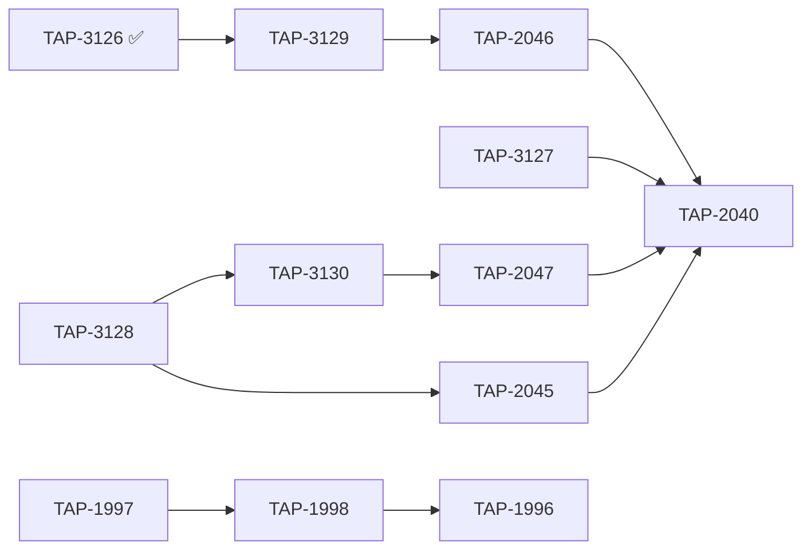

# TappsMCP Platform — Sprint Board

**Project:** [TappsMCP Platform](https://linear.app/tappscodingagents/project/tappsmcp-platform-105f94bfc199)  
**Team:** TappsCodingAgents (TAP)  
**Last updated:** 2026-06-09  
**Open issues:** 2 (was 12; Track A complete — S1–S9 done)

> **Execution rule:** Work top-to-bottom. Do not skip slots unless a blocker is filed.
> Track B (brain migration) may run in parallel with Track A slots S2–S4.

---

## Priority queue (single source of order)

| Slot | Status | Issue | Title | P | Est. | Track | Blocked by |
|------|--------|-------|-------|---|------|-------|------------|
| **S1** | ✅ Done | [TAP-3126](https://linear.app/tappscodingagents/issue/TAP-3126) | Defuse `ElementTree.parse` in `checklist.py` (B314) | High | 0.5d | Security | — |
| **S2** | ✅ Done | [TAP-3129](https://linear.app/tappscodingagents/issue/TAP-3129) | Audit-digest session #5 (B110/B405, ruff I001) | Med | 1d | Audit fix | S1 |
| **S3** | ✅ Done | [TAP-3127](https://linear.app/tappscodingagents/issue/TAP-3127) | Audit-digest session #3 (subprocess + B110) | Med | 1d | Audit fix | — |
| **S4** | ✅ Done | [TAP-3128](https://linear.app/tappscodingagents/issue/TAP-3128) | Audit-digest session #4 (subprocess_runner, vulture) | Med | 1d | Audit fix | — |
| **S5** | ✅ Done | [TAP-3130](https://linear.app/tappscodingagents/issue/TAP-3130) | Audit-digest session #6 (release_update subprocess) | Med | 0.5d | Audit fix | S4* |
| **S6** | ✅ Done | [TAP-2045](https://linear.app/tappscodingagents/issue/TAP-2045) | Close audit session #4 | Med | — | Audit close | S4 |
| **S7** | ✅ Done | [TAP-2046](https://linear.app/tappscodingagents/issue/TAP-2046) | Close audit session #5 | Med | — | Audit close | S2 |
| **S8** | ✅ Done | [TAP-2047](https://linear.app/tappscodingagents/issue/TAP-2047) | Close audit session #6 | Med | — | Audit close | S5 |
| **S9** | ✅ Done | [TAP-2040](https://linear.app/tappscodingagents/issue/TAP-2040) | Close audit campaign epic | Med | 0.5d | Audit close | S6–S8 |
| **S10** | 🟡 In progress | [TAP-1997](https://linear.app/tappscodingagents/issue/TAP-1997) | Metrics → `brain_record_event` | Med | 2–3d | Brain | brain_query_events † |
| **S11** | ⬜ Backlog | [TAP-1998](https://linear.app/tappscodingagents/issue/TAP-1998) | `domain_weights.yaml` → brain profiles | Med | 2–4d | Brain | Spike ‡ |
| **S12** | ⬜ Backlog | [TAP-1996](https://linear.app/tappscodingagents/issue/TAP-1996) | Close brain migration epic | Med | 0.5d | Brain | S10, S11 |

\* S5 can batch with S4 (shared subprocess-hardening theme).  
† S10 parallel with S2–S9 (different packages: `tapps-core` vs `tapps_mcp/tools`).  
‡ S11 requires spike: confirm brain profile-data API exists before implementation.

---

## Kanban snapshot

```
DONE          NEXT          IN PROGRESS    BACKLOG
────          ────          ───────────    ───────
TAP-3126      TAP-1997      (empty)        TAP-1998 → TAP-1996
TAP-3129
TAP-3127
TAP-3128
TAP-3130
TAP-2040
TAP-2045
TAP-2046
TAP-2047
```

---

## Track A — Audit campaign ([TAP-2040](https://linear.app/tappscodingagents/issue/TAP-2040))

**Goal:** ~~Land all digest fixes, then close session tickets and the campaign epic.~~ **Complete** (2026-06-09).

| Session | Audit ticket | Digest fix | Files | Audit status |
|---------|--------------|------------|-------|--------------|
| #1 | [TAP-2041](https://linear.app/tappscodingagents/issue/TAP-2041) ✅ | [TAP-2769](https://linear.app/tappscodingagents/issue/TAP-2769) ✅ | audit_campaign cluster (9) | Closed |
| #2 | [TAP-2043](https://linear.app/tappscodingagents/issue/TAP-2043) ✅ | [TAP-2776](https://linear.app/tappscodingagents/issue/TAP-2776) ✅ | bandit cluster (8) | Closed |
| #3 | [TAP-2044](https://linear.app/tappscodingagents/issue/TAP-2044) ✅ | [TAP-3127](https://linear.app/tappscodingagents/issue/TAP-3127) ✅ | `batch_validator`, `validate_changed` | Closed |
| #4 | [TAP-2045](https://linear.app/tappscodingagents/issue/TAP-2045) ✅ | [TAP-3128](https://linear.app/tappscodingagents/issue/TAP-3128) ✅ | `subprocess_runner`, `vulture` | Closed |
| #5 | [TAP-2046](https://linear.app/tappscodingagents/issue/TAP-2046) ✅ | [TAP-3129](https://linear.app/tappscodingagents/issue/TAP-3129) ✅ | `checklist`, `session_start_helpers` | Closed |
| #6 | [TAP-2047](https://linear.app/tappscodingagents/issue/TAP-2047) ✅ | [TAP-3130](https://linear.app/tappscodingagents/issue/TAP-3130) ✅ | `release_update` | Closed |

Epic [TAP-2040](https://linear.app/tappscodingagents/issue/TAP-2040) **Done**. TAP-2042 canceled (duplicate).

---

## Track B — Brain migration ([TAP-1996](https://linear.app/tappscodingagents/issue/TAP-1996))

**Goal:** Retire remaining `.tapps-mcp/` local state writes.

| Child | Status | Scope |
|-------|--------|-------|
| [TAP-1999](https://linear.app/tappscodingagents/issue/TAP-1999) session marker | ✅ Done | — |
| [TAP-2001](https://linear.app/tappscodingagents/issue/TAP-2001) learning/ audit | ✅ Done | — |
| [TAP-2000](https://linear.app/tappscodingagents/issue/TAP-2000) checklist-state | ✅ Done | — |
| [TAP-1997](https://linear.app/tappscodingagents/issue/TAP-1997) metrics | 🟡 S10 phase 1.5 | KG events + memory persist; all emitters use `entity_spec`; phase 2 blocked on `brain_query_events` |
| [TAP-1998](https://linear.app/tappscodingagents/issue/TAP-1998) adaptive weights | ⬜ S11 | Spike → `DomainWeightStore` migration |

---

## Critical path



---

## Session checklist (per slot)

Before marking any slot **Done**:

1. Implementation merged / working tree clean for that issue scope
2. `uv run pytest` on affected test files
3. `uv run bandit` on changed security-sensitive files
4. `tapps_validate_changed` on touched Python paths (when MCP available)
5. Linear issue moved to **Done** (via `linear-issue` skill)

---

## Changelog

| Date | Slot | Event |
|------|------|-------|
| 2026-06-08 | S1 | TAP-3126 implemented — `defusedxml` for `coverage.xml` parse in `checklist.py` |
| 2026-06-08 | S2 | TAP-3129 implemented — B110 log-on-fail in `_check_coverage`; ruff I001 in `session_start_helpers.py` |
| 2026-06-08 | S3 | TAP-3127 implemented — `batch_validator` via `run_command`; B110 debug log in `validate_changed` |
| 2026-06-08 | S4 | TAP-3128 implemented — `vulture` git diff via `run_command`; `nosec` on `subprocess_runner` gateway |
| 2026-06-08 | S5 | TAP-3130 implemented — `release_update` git log via `run_command` |
| 2026-06-08 | S6 | TAP-2045 + TAP-3128 closed — session #4 audit complete, digest fix verified at `5420e22` |
| 2026-06-08 | S7 | TAP-2046 + TAP-3126 + TAP-3129 closed — session #5 audit complete, defusedxml + ruff fixes verified at `5420e22` |
| 2026-06-08 | S8 | TAP-2047 + TAP-3130 closed — session #6 audit complete, `run_command` git log fix verified at `5420e22` |
| 2026-06-09 | S9 | TAP-2040 campaign epic closed — all 6 sessions + digests Done; TAP-3127 closed; coverage manifest deferred (brain auth) |
| 2026-06-09 | S10 | TAP-1997 phase 1.5 — memory-backed metric persist + `TAPPS_METRICS_STORAGE=brain`; phase 2 blocked on `brain_query_events` |
| 2026-06-09 | S10 | TAP-1997 emit shapes — `entity_spec()` on all `record_kg_event` sites; waiting on tapps-brain P0 (`brain_query_events`) |
| 2026-06-08 | — | Sprint board created from open-issues implementation plan |
