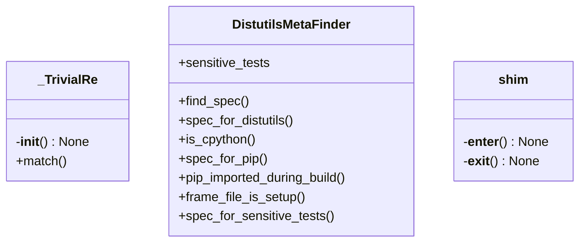

# Class Hierarchy

```mermaid
classDiagram
    class _TrivialRe {
        -__init__() None
        +match()
    }
    class DistutilsMetaFinder {
        +sensitive_tests
        +find_spec()
        +spec_for_distutils()
        +is_cpython()
        +spec_for_pip()
        +pip_imported_during_build()
        +frame_file_is_setup()
        +spec_for_sensitive_tests()
    }
    class shim {
        -__enter__() None
        -__exit__() None
    }

```
