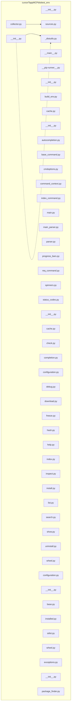

# docs-mcp Dependency

```mermaid
graph TD
    subgraph cursorTappMCPdisttest_env["cursorTappMCPdisttest_env"]
        cursorTappMCPdisttest_env_Lib_site_packages_pip___init___py["__init__.py"]
        cursorTappMCPdisttest_env_Lib_site_packages_pip___main___py["__main__.py"]
        cursorTappMCPdisttest_env_Lib_site_packages_pip___pip_runner___py["__pip-runner__.py"]
        cursorTappMCPdisttest_env_Lib_site_packages_pip__internal___init___py["__init__.py"]
        cursorTappMCPdisttest_env_Lib_site_packages_pip__internal_build_env_py["build_env.py"]
        cursorTappMCPdisttest_env_Lib_site_packages_pip__internal_cache_py["cache.py"]
        cursorTappMCPdisttest_env_Lib_site_packages_pip__internal_cli___init___py["__init__.py"]
        cursorTappMCPdisttest_env_Lib_site_packages_pip__internal_cli_autocompletion_py["autocompletion.py"]
        cursorTappMCPdisttest_env_Lib_site_packages_pip__internal_cli_base_command_py["base_command.py"]
        cursorTappMCPdisttest_env_Lib_site_packages_pip__internal_cli_cmdoptions_py["cmdoptions.py"]
        cursorTappMCPdisttest_env_Lib_site_packages_pip__internal_cli_command_context_py["command_context.py"]
        cursorTappMCPdisttest_env_Lib_site_packages_pip__internal_cli_index_command_py["index_command.py"]
        cursorTappMCPdisttest_env_Lib_site_packages_pip__internal_cli_main_py["main.py"]
        cursorTappMCPdisttest_env_Lib_site_packages_pip__internal_cli_main_parser_py["main_parser.py"]
        cursorTappMCPdisttest_env_Lib_site_packages_pip__internal_cli_parser_py["parser.py"]
        cursorTappMCPdisttest_env_Lib_site_packages_pip__internal_cli_progress_bars_py["progress_bars.py"]
        cursorTappMCPdisttest_env_Lib_site_packages_pip__internal_cli_req_command_py["req_command.py"]
        cursorTappMCPdisttest_env_Lib_site_packages_pip__internal_cli_spinners_py["spinners.py"]
        cursorTappMCPdisttest_env_Lib_site_packages_pip__internal_cli_status_codes_py["status_codes.py"]
        cursorTappMCPdisttest_env_Lib_site_packages_pip__internal_commands___init___py["__init__.py"]
        cursorTappMCPdisttest_env_Lib_site_packages_pip__internal_commands_cache_py["cache.py"]
        cursorTappMCPdisttest_env_Lib_site_packages_pip__internal_commands_check_py["check.py"]
        cursorTappMCPdisttest_env_Lib_site_packages_pip__internal_commands_completion_py["completion.py"]
        cursorTappMCPdisttest_env_Lib_site_packages_pip__internal_commands_configuration_py["configuration.py"]
        cursorTappMCPdisttest_env_Lib_site_packages_pip__internal_commands_debug_py["debug.py"]
        cursorTappMCPdisttest_env_Lib_site_packages_pip__internal_commands_download_py["download.py"]
        cursorTappMCPdisttest_env_Lib_site_packages_pip__internal_commands_freeze_py["freeze.py"]
        cursorTappMCPdisttest_env_Lib_site_packages_pip__internal_commands_hash_py["hash.py"]
        cursorTappMCPdisttest_env_Lib_site_packages_pip__internal_commands_help_py["help.py"]
        cursorTappMCPdisttest_env_Lib_site_packages_pip__internal_commands_index_py["index.py"]
        cursorTappMCPdisttest_env_Lib_site_packages_pip__internal_commands_inspect_py["inspect.py"]
        cursorTappMCPdisttest_env_Lib_site_packages_pip__internal_commands_install_py["install.py"]
        cursorTappMCPdisttest_env_Lib_site_packages_pip__internal_commands_list_py["list.py"]
        cursorTappMCPdisttest_env_Lib_site_packages_pip__internal_commands_search_py["search.py"]
        cursorTappMCPdisttest_env_Lib_site_packages_pip__internal_commands_show_py["show.py"]
        cursorTappMCPdisttest_env_Lib_site_packages_pip__internal_commands_uninstall_py["uninstall.py"]
        cursorTappMCPdisttest_env_Lib_site_packages_pip__internal_commands_wheel_py["wheel.py"]
        cursorTappMCPdisttest_env_Lib_site_packages_pip__internal_configuration_py["configuration.py"]
        cursorTappMCPdisttest_env_Lib_site_packages_pip__internal_distributions___init___py["__init__.py"]
        cursorTappMCPdisttest_env_Lib_site_packages_pip__internal_distributions_base_py["base.py"]
        cursorTappMCPdisttest_env_Lib_site_packages_pip__internal_distributions_installed_py["installed.py"]
        cursorTappMCPdisttest_env_Lib_site_packages_pip__internal_distributions_sdist_py["sdist.py"]
        cursorTappMCPdisttest_env_Lib_site_packages_pip__internal_distributions_wheel_py["wheel.py"]
        cursorTappMCPdisttest_env_Lib_site_packages_pip__internal_exceptions_py["exceptions.py"]
        cursorTappMCPdisttest_env_Lib_site_packages_pip__internal_index___init___py["__init__.py"]
        cursorTappMCPdisttest_env_Lib_site_packages_pip__internal_index_collector_py["collector.py"]
        cursorTappMCPdisttest_env_Lib_site_packages_pip__internal_index_package_finder_py["package_finder.py"]
        cursorTappMCPdisttest_env_Lib_site_packages_pip__internal_index_sources_py["sources.py"]
        cursorTappMCPdisttest_env_Lib_site_packages_pip__internal_locations___init___py["__init__.py"]
        cursorTappMCPdisttest_env_Lib_site_packages_pip__internal_locations__distutils_py["_distutils.py"]
    end
    cursorTappMCPdisttest_env_Lib_site_packages_pip__internal_index_collector_py --> cursorTappMCPdisttest_env_Lib_site_packages_pip__internal_index_sources_py
    cursorTappMCPdisttest_env_Lib_site_packages_pip__internal_locations___init___py --> cursorTappMCPdisttest_env_Lib_site_packages_pip__internal_locations__distutils_py
    cursorTappMCPdisttest_env_Lib_site_packages_pip__internal_locations___init___py -.-> cursorTappMCPdisttest_env_Lib_site_packages_pip__internal_locations__distutils_py
    %% Truncated: showing 50 of 1145 modules

```
