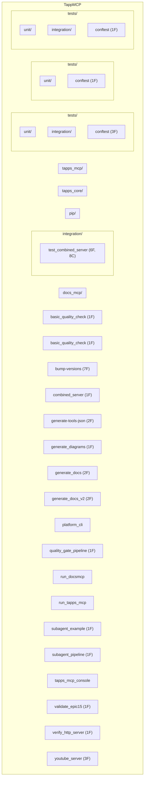

# tapps-mcp Module Map

```mermaid
graph TD
    subgraph TappMCP["TappMCP"]
        examples_agent_sdk_python_basic_quality_check_py["basic_quality_check (1F)"]
        examples_agent_sdk_typescript_basic_quality_check_ts["basic_quality_check (1F)"]
        scripts_bump_versions_py["bump-versions (7F)"]
        examples_combined_server_py["combined_server (1F)"]
        subgraph packages_docs_mcp_src_docs_mcp["docs_mcp/"]
        end
        scripts_generate_tools_json_py["generate-tools-json (2F)"]
        generate_diagrams_py["generate_diagrams (1F)"]
        generate_docs_py["generate_docs (2F)"]
        generate_docs_v2_py["generate_docs_v2 (2F)"]
        subgraph tests_integration["integration/"]
            tests_integration_test_combined_server_py["test_combined_server (6F, 8C)"]
        end
        subgraph cursorTappMCPdisttest_env_Lib_site_packages_pip["pip/"]
        end
        examples_platform_cli_py["platform_cli"]
        examples_agent_sdk_python_quality_gate_pipeline_py["quality_gate_pipeline (1F)"]
        scripts_run_docsmcp_py["run_docsmcp"]
        scripts_run_tapps_mcp_py["run_tapps_mcp"]
        examples_agent_sdk_python_subagent_example_py["subagent_example (1F)"]
        examples_agent_sdk_typescript_subagent_pipeline_ts["subagent_pipeline (1F)"]
        subgraph packages_tapps_core_src_tapps_core["tapps_core/"]
        end
        subgraph packages_tapps_mcp_src_tapps_mcp["tapps_mcp/"]
        end
        scripts_tapps_mcp_console_py["tapps_mcp_console"]
        subgraph packages_docs_mcp_tests["tests/"]
            packages_docs_mcp_tests_conftest_py["conftest (3F)"]
            subgraph packages_docs_mcp_tests_integration["integration/"]
            end
            subgraph packages_docs_mcp_tests_unit["unit/"]
            end
        end
        subgraph packages_tapps_core_tests["tests/"]
            packages_tapps_core_tests_conftest_py["conftest (1F)"]
            subgraph packages_tapps_core_tests_unit["unit/"]
            end
        end
        subgraph packages_tapps_mcp_tests["tests/"]
            packages_tapps_mcp_tests_conftest_py["conftest (1F)"]
            subgraph packages_tapps_mcp_tests_integration["integration/"]
            end
            subgraph packages_tapps_mcp_tests_unit["unit/"]
            end
        end
        scripts_validate_epic15_py["validate_epic15 (1F)"]
        scripts_verify_http_server_py["verify_http_server (1F)"]
        tools_youtube_mcp_youtube_server_py["youtube_server (3F)"]
    end

```
