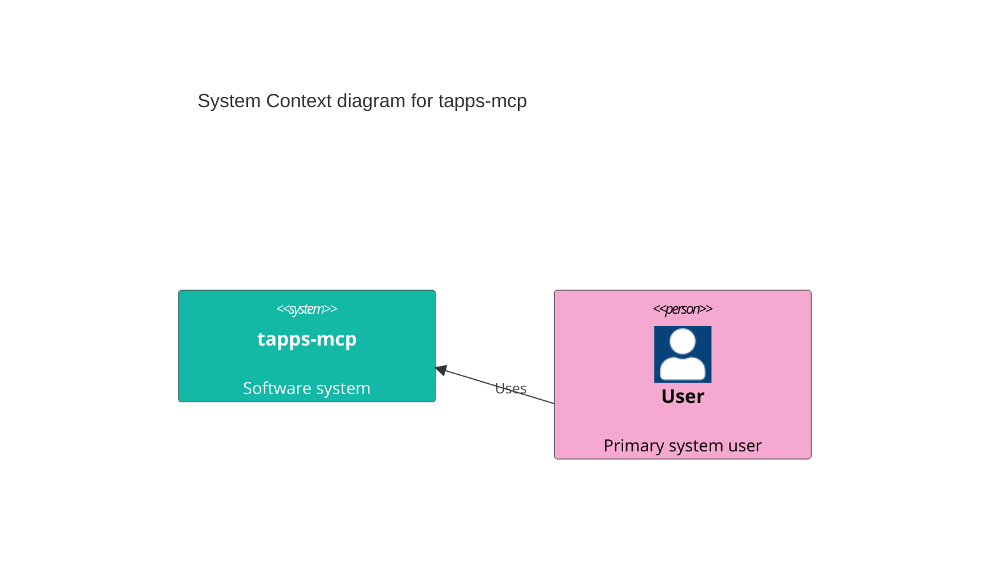

# C4 — System Context

Auto-generated by `docs_generate_diagram(diagram_type="c4_context", scope="project", format="mermaid", direction="LR")`.

```mermaid
C4Context
    title System Context diagram for tapps-mcp

    System(tapps_mcp, "tapps-mcp", "Software system")

    Person(User, "User", "Primary system user")

    Rel(User, tapps_mcp, "Uses")

    UpdateElementStyle(tapps_mcp, $bgColor="#14B8A6", $fontColor="#fff", $borderColor="#333")
    UpdateElementStyle(User, $bgColor="#F5A9D0", $fontColor="#000", $borderColor="#333")
```
