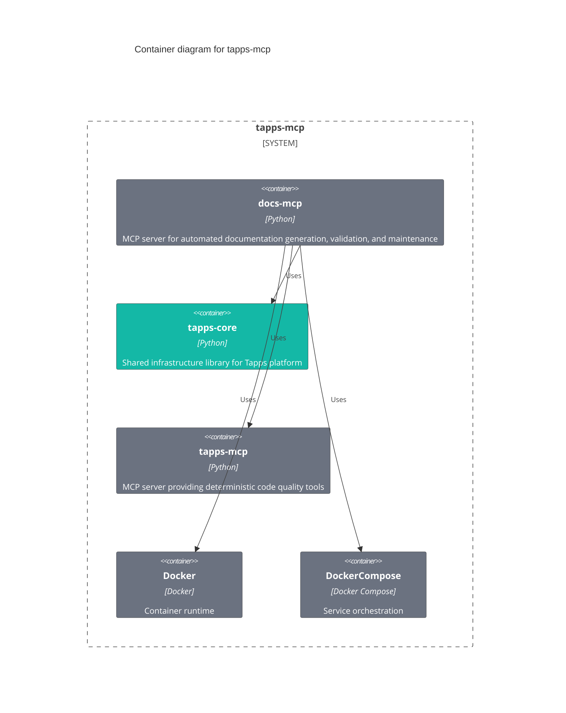

# C4 — Container

Auto-generated by `docs_generate_diagram(diagram_type="c4_container", scope="project", format="mermaid", direction="TB")`.

```mermaid
C4Container
    title Container diagram for tapps-mcp

    System_Boundary(tapps_mcp, "tapps-mcp") {
        Container(docs_mcp, "docs-mcp", "Python", "MCP server for automated documentation generation, validation, and maintenance")
        Container(tapps_core, "tapps-core", "Python", "Shared infrastructure library for Tapps platform")
        Container(tapps_mcp_pkg, "tapps-mcp", "Python", "MCP server providing deterministic code quality tools")
        Container(Docker, "Docker", "Docker", "Container runtime")
        Container(DockerCompose, "DockerCompose", "Docker Compose", "Service orchestration")
    }

    Rel(docs_mcp, tapps_core, "Uses")
    Rel(docs_mcp, tapps_mcp_pkg, "Uses")
    Rel(docs_mcp, Docker, "Uses")
    Rel(docs_mcp, DockerCompose, "Uses")

    UpdateElementStyle(docs_mcp, $bgColor="#6B7280", $fontColor="#fff", $borderColor="#333")
    UpdateElementStyle(tapps_core, $bgColor="#14B8A6", $fontColor="#fff", $borderColor="#333")
    UpdateElementStyle(tapps_mcp_pkg, $bgColor="#6B7280", $fontColor="#fff", $borderColor="#333")
    UpdateElementStyle(Docker, $bgColor="#6B7280", $fontColor="#fff", $borderColor="#333")
    UpdateElementStyle(DockerCompose, $bgColor="#6B7280", $fontColor="#fff", $borderColor="#333")
```
