# Module Map

Top-level project module map. Auto-generated by `docs_generate_diagram(diagram_type="module_map", scope="project", format="mermaid")`.

For the deep per-package module trees, see [docs/api/tapps-mcp.md](../api/tapps-mcp.md), [docs/api/docs-mcp.md](../api/docs-mcp.md), and [docs/api/tapps-core.md](../api/tapps-core.md).

```mermaid
graph TD
    subgraph tapps_mcp["tapps-mcp"]
        scripts_build_epic_stories_py["build_epic_stories (1F)"]:::presentation
        scripts_bump_versions_py["bump-versions (16F)"]:::infra
        scripts_check_tool_budget_py["check-tool-budget (5F)"]:::infra
        examples_combined_server_py["combined_server (1F)"]:::presentation
        scripts_eval_descriptions_compare_py["compare (12F)"]:::infra
        scripts_docs_quality_gate_py["docs-quality-gate (1F)"]:::infra
        scripts_generate_tools_json_py["generate-tools-json (2F)"]:::business
        subgraph tests_integration["integration/"]
            tests_integration_test_combined_server_py["test_combined_server (6F, 8C)"]:::infra
        end
        examples_platform_cli_py["platform_cli"]:::presentation
        scripts_eval_descriptions_report_py["report (3F)"]:::infra
        subgraph reports["reports/"]
            subgraph reports_tapps_architecture["tapps_architecture/"]
                reports_tapps_architecture_story_py["story (2F)"]:::infra
            end
        end
        scripts_eval_descriptions_run_py["run (14F, 1C)"]:::infra
        scripts_run_docsmcp_py["run_docsmcp"]:::infra
        scripts_run_tapps_mcp_py["run_tapps_mcp"]:::infra
        scripts_tapps_mcp_console_py["tapps_mcp_console"]:::infra
        tests_reports_test_tapps_architecture_py["test_tapps_architecture (2F)"]:::infra
        subgraph packages_docs_mcp_tests["tests/"]
        end
        subgraph packages_tapps_core_tests["tests/"]
        end
        subgraph packages_tapps_mcp_tests["tests/"]
        end
        scripts_validate_epic15_py["validate_epic15 (1F)"]:::infra
        scripts_verify_http_server_py["verify_http_server (1F)"]:::presentation
    end
    classDef presentation fill:#F5A9D0,stroke:#333,color:#000
    classDef business fill:#14B8A6,stroke:#333,color:#fff
    classDef data fill:#9333EA,stroke:#333,color:#fff
    classDef infra fill:#6B7280,stroke:#333,color:#fff
```

