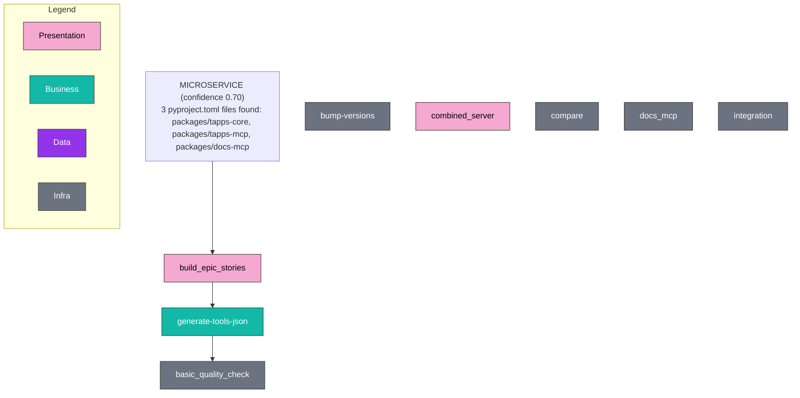

# Architectural Archetype — Pattern Card

Auto-classified by `docs-mcp`'s deterministic pattern classifier. tapps-mcp is detected as **microservice** with confidence 0.70 (3 `pyproject.toml` files in `packages/tapps-core`, `packages/tapps-mcp`, `packages/docs-mcp`).

Auto-generated by `docs_generate_diagram(diagram_type="pattern_card", scope="project", format="mermaid")`.

**Note on "microservice":** the classifier reports microservice because multiple `pyproject.toml` files mark independently versioned packages. The runtime topology is *not* multi-process: tapps-mcp and docs-mcp are independent MCP servers, and tapps-core is a shared library imported by both. The shared dependency is `tapps-brain`, which *is* a separate service (Postgres @ :8080).
