# C4 — Component (tapps-mcp)

Internal components of the `tapps_mcp` package. Auto-generated by `docs_generate_diagram(diagram_type="c4_component", scope="packages/tapps-mcp/src/tapps_mcp", format="mermaid", direction="TD")`.

```mermaid
C4Component
    title Component diagram for tapps_mcp

    Container_Boundary(tapps_mcp, "tapps_mcp") {
        Component(adaptive, "adaptive", "Python", "0 functions, 0 classes")
        Component(benchmark, "benchmark", "Python", "0 functions, 0 classes")
        Component(cli, "cli", "Python", "43 functions, 0 classes")
        Component(common, "common", "Python", "0 functions, 0 classes")
        Component(config, "config", "Python", "0 functions, 0 classes")
        Component(diagnostics, "diagnostics", "Python", "6 functions, 0 classes")
        Component(distribution, "distribution", "Python", "0 functions, 0 classes")
        Component(gates, "gates", "Python", "0 functions, 0 classes")
        Component(knowledge, "knowledge", "Python", "0 functions, 0 classes")
        Component(mcp_register, "mcp_register", "Python", "1 functions, 0 classes")
        Component(memory, "memory", "Python", "0 functions, 0 classes")
        Component(metrics, "metrics", "Python", "0 functions, 0 classes")
        Component(pipeline, "pipeline", "Python", "0 functions, 0 classes")
        Component(platform, "platform", "Python", "0 functions, 0 classes")
        Component(project, "project", "Python", "0 functions, 0 classes")
        Component(prompts, "prompts", "Python", "0 functions, 0 classes")
        Component(quick_check_recurring, "quick_check_recurring", "Python", "7 functions, 0 classes")
        Component(scoring, "scoring", "Python", "1 functions, 0 classes")
        Component(security, "security", "Python", "0 functions, 0 classes")
        Component(server, "server", "Python", "34 functions, 0 classes")
        Component(server_analysis_tools, "server_analysis_tools", "Python", "22 functions, 1 classes")
        Component(server_helpers, "server_helpers", "Python", "36 functions, 0 classes")
        Component(server_linear_tools, "server_linear_tools", "Python", "17 functions, 0 classes")
        Component(server_memory_tools, "server_memory_tools", "Python", "84 functions, 1 classes")
        Component(server_metrics_tools, "server_metrics_tools", "Python", "12 functions, 0 classes")
        Component(server_pipeline_tools, "server_pipeline_tools", "Python", "21 functions, 1 classes")
        Component(server_release_tools, "server_release_tools", "Python", "4 functions, 0 classes")
        Component(server_resources, "server_resources", "Python", "6 functions, 0 classes")
        Component(server_scoring_tools, "server_scoring_tools", "Python", "22 functions, 0 classes")
        Component(tool_descriptions, "tool_descriptions", "Python", "0 functions, 0 classes")
        Component(tools, "tools", "Python", "0 functions, 0 classes")
        Component(validators, "validators", "Python", "0 functions, 0 classes")
    }

    UpdateElementStyle(adaptive, $bgColor="#6B7280", $fontColor="#fff", $borderColor="#333")
    UpdateElementStyle(benchmark, $bgColor="#6B7280", $fontColor="#fff", $borderColor="#333")
    UpdateElementStyle(cli, $bgColor="#F5A9D0", $fontColor="#000", $borderColor="#333")
    UpdateElementStyle(common, $bgColor="#6B7280", $fontColor="#fff", $borderColor="#333")
    UpdateElementStyle(config, $bgColor="#6B7280", $fontColor="#fff", $borderColor="#333")
    UpdateElementStyle(diagnostics, $bgColor="#6B7280", $fontColor="#fff", $borderColor="#333")
    UpdateElementStyle(distribution, $bgColor="#6B7280", $fontColor="#fff", $borderColor="#333")
    UpdateElementStyle(gates, $bgColor="#6B7280", $fontColor="#fff", $borderColor="#333")
    UpdateElementStyle(knowledge, $bgColor="#6B7280", $fontColor="#fff", $borderColor="#333")
    UpdateElementStyle(mcp_register, $bgColor="#6B7280", $fontColor="#fff", $borderColor="#333")
    UpdateElementStyle(memory, $bgColor="#9333EA", $fontColor="#fff", $borderColor="#333")
    UpdateElementStyle(metrics, $bgColor="#6B7280", $fontColor="#fff", $borderColor="#333")
    UpdateElementStyle(pipeline, $bgColor="#14B8A6", $fontColor="#fff", $borderColor="#333")
    UpdateElementStyle(platform, $bgColor="#6B7280", $fontColor="#fff", $borderColor="#333")
    UpdateElementStyle(project, $bgColor="#6B7280", $fontColor="#fff", $borderColor="#333")
    UpdateElementStyle(prompts, $bgColor="#6B7280", $fontColor="#fff", $borderColor="#333")
    UpdateElementStyle(quick_check_recurring, $bgColor="#F5A9D0", $fontColor="#000", $borderColor="#333")
    UpdateElementStyle(scoring, $bgColor="#6B7280", $fontColor="#fff", $borderColor="#333")
    UpdateElementStyle(security, $bgColor="#6B7280", $fontColor="#fff", $borderColor="#333")
    UpdateElementStyle(server, $bgColor="#F5A9D0", $fontColor="#000", $borderColor="#333")
    UpdateElementStyle(server_analysis_tools, $bgColor="#F5A9D0", $fontColor="#000", $borderColor="#333")
    UpdateElementStyle(server_helpers, $bgColor="#F5A9D0", $fontColor="#000", $borderColor="#333")
    UpdateElementStyle(server_linear_tools, $bgColor="#F5A9D0", $fontColor="#000", $borderColor="#333")
    UpdateElementStyle(server_memory_tools, $bgColor="#F5A9D0", $fontColor="#000", $borderColor="#333")
    UpdateElementStyle(server_metrics_tools, $bgColor="#F5A9D0", $fontColor="#000", $borderColor="#333")
    UpdateElementStyle(server_pipeline_tools, $bgColor="#F5A9D0", $fontColor="#000", $borderColor="#333")
    UpdateElementStyle(server_release_tools, $bgColor="#F5A9D0", $fontColor="#000", $borderColor="#333")
    UpdateElementStyle(server_resources, $bgColor="#F5A9D0", $fontColor="#000", $borderColor="#333")
    UpdateElementStyle(server_scoring_tools, $bgColor="#F5A9D0", $fontColor="#000", $borderColor="#333")
    UpdateElementStyle(tool_descriptions, $bgColor="#6B7280", $fontColor="#fff", $borderColor="#333")
    UpdateElementStyle(tools, $bgColor="#14B8A6", $fontColor="#fff", $borderColor="#333")
    UpdateElementStyle(validators, $bgColor="#14B8A6", $fontColor="#fff", $borderColor="#333")
```

The `tools`, `pipeline`, `scoring`, and `validators` packages hold pure logic. Pink `server*` modules are the FastMCP tool-registration surface split by domain (scoring, pipeline, memory, linear, etc.).
