# C4 — Component (docs-mcp)

Internal components of the `docs_mcp` package. Auto-generated by `docs_generate_diagram(diagram_type="c4_component", scope="packages/docs-mcp/src/docs_mcp", format="mermaid", direction="TD")`.

```mermaid
C4Component
    title Component diagram for docs_mcp

    Container_Boundary(docs_mcp, "docs_mcp") {
        Component(agents, "agents", "Python", "0 functions, 0 classes")
        Component(analyzers, "analyzers", "Python", "0 functions, 0 classes")
        Component(cli, "cli", "Python", "9 functions, 0 classes")
        Component(config, "config", "Python", "0 functions, 0 classes")
        Component(constants, "constants", "Python", "0 functions, 0 classes")
        Component(extractors, "extractors", "Python", "0 functions, 0 classes")
        Component(generators, "generators", "Python", "0 functions, 0 classes")
        Component(integrations, "integrations", "Python", "0 functions, 0 classes")
        Component(linters, "linters", "Python", "0 functions, 0 classes")
        Component(mcp_register, "mcp_register", "Python", "1 functions, 0 classes")
        Component(server, "server", "Python", "23 functions, 0 classes")
        Component(server_analysis, "server_analysis", "Python", "3 functions, 0 classes")
        Component(server_gen_tools, "server_gen_tools", "Python", "22 functions, 0 classes")
        Component(server_git_tools, "server_git_tools", "Python", "2 functions, 0 classes")
        Component(server_helpers, "server_helpers", "Python", "16 functions, 0 classes")
        Component(server_kg_tools, "server_kg_tools", "Python", "3 functions, 0 classes")
        Component(server_linear_tools, "server_linear_tools", "Python", "12 functions, 0 classes")
        Component(server_resources, "server_resources", "Python", "5 functions, 0 classes")
        Component(server_val_tools, "server_val_tools", "Python", "18 functions, 0 classes")
        Component(tool_descriptions, "tool_descriptions", "Python", "0 functions, 0 classes")
        Component(triage, "triage", "Python", "0 functions, 0 classes")
        Component(validators, "validators", "Python", "0 functions, 0 classes")
    }

    UpdateElementStyle(agents, $bgColor="#6B7280", $fontColor="#fff", $borderColor="#333")
    UpdateElementStyle(analyzers, $bgColor="#14B8A6", $fontColor="#fff", $borderColor="#333")
    UpdateElementStyle(cli, $bgColor="#F5A9D0", $fontColor="#000", $borderColor="#333")
    UpdateElementStyle(config, $bgColor="#6B7280", $fontColor="#fff", $borderColor="#333")
    UpdateElementStyle(constants, $bgColor="#6B7280", $fontColor="#fff", $borderColor="#333")
    UpdateElementStyle(extractors, $bgColor="#14B8A6", $fontColor="#fff", $borderColor="#333")
    UpdateElementStyle(generators, $bgColor="#14B8A6", $fontColor="#fff", $borderColor="#333")
    UpdateElementStyle(integrations, $bgColor="#6B7280", $fontColor="#fff", $borderColor="#333")
    UpdateElementStyle(linters, $bgColor="#6B7280", $fontColor="#fff", $borderColor="#333")
    UpdateElementStyle(mcp_register, $bgColor="#6B7280", $fontColor="#fff", $borderColor="#333")
    UpdateElementStyle(server, $bgColor="#F5A9D0", $fontColor="#000", $borderColor="#333")
    UpdateElementStyle(server_analysis, $bgColor="#F5A9D0", $fontColor="#000", $borderColor="#333")
    UpdateElementStyle(server_gen_tools, $bgColor="#F5A9D0", $fontColor="#000", $borderColor="#333")
    UpdateElementStyle(server_git_tools, $bgColor="#F5A9D0", $fontColor="#000", $borderColor="#333")
    UpdateElementStyle(server_helpers, $bgColor="#F5A9D0", $fontColor="#000", $borderColor="#333")
    UpdateElementStyle(server_kg_tools, $bgColor="#F5A9D0", $fontColor="#000", $borderColor="#333")
    UpdateElementStyle(server_linear_tools, $bgColor="#F5A9D0", $fontColor="#000", $borderColor="#333")
    UpdateElementStyle(server_resources, $bgColor="#F5A9D0", $fontColor="#000", $borderColor="#333")
    UpdateElementStyle(server_val_tools, $bgColor="#F5A9D0", $fontColor="#000", $borderColor="#333")
    UpdateElementStyle(tool_descriptions, $bgColor="#6B7280", $fontColor="#fff", $borderColor="#333")
    UpdateElementStyle(triage, $bgColor="#6B7280", $fontColor="#fff", $borderColor="#333")
    UpdateElementStyle(validators, $bgColor="#14B8A6", $fontColor="#fff", $borderColor="#333")
```

The `analyzers`, `extractors`, `generators`, and `validators` packages hold the pure logic (AST parsers, language extractors, document generators, drift/link/style checkers). The pink `server*` modules are the FastMCP tool-registration surface.
