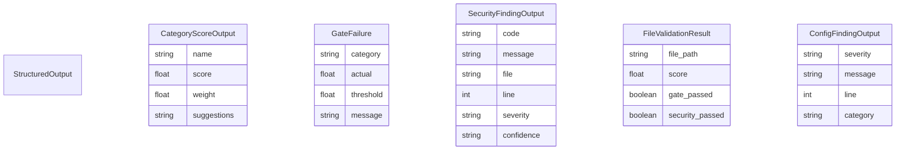

# ER — Structured Output Schemas

Pydantic models that define `structuredContent` for tapps-mcp tool responses. Source: [packages/tapps-mcp/src/tapps_mcp/common/output_schemas.py](../../packages/tapps-mcp/src/tapps_mcp/common/output_schemas.py).

Auto-generated by `docs_generate_diagram(diagram_type="er_diagram", scope="packages/tapps-mcp/src/tapps_mcp/common/output_schemas.py", format="mermaid")`.

Each tool returns the schema's JSON shape in `structuredContent` alongside the human-readable text content. MCP clients that support `structuredContent` can parse the structured fields directly.
