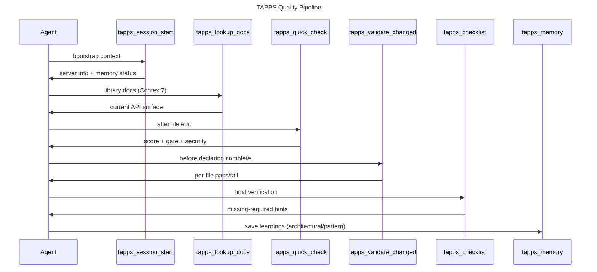

# Sequence — TAPPS Quality Pipeline

The recommended tool call order for a coding session. Auto-generated by `docs_generate_diagram(diagram_type="sequence", flow_spec=...)`.

| Step | Tool | When | Cost |
|---|---|---|---|
| 1 | `tapps_session_start` | first call in every session | cached < 1s on repeat |
| 2 | `tapps_lookup_docs` | before using any external library | local-cache-first, near-zero on repeat |
| 3 | `tapps_quick_check` | after every Python edit | ~5s |
| 4 | `tapps_validate_changed` | before declaring multi-file work complete | ~10-30s (depends on file count) |
| 5 | `tapps_checklist` | final step before "done" | < 1s |
| 6 | `tapps_memory(action="save")` | save architectural/pattern findings | < 1s |

This flow is enforced by the `tapps_checklist` tool — calling it at the end reports which required steps were skipped.
