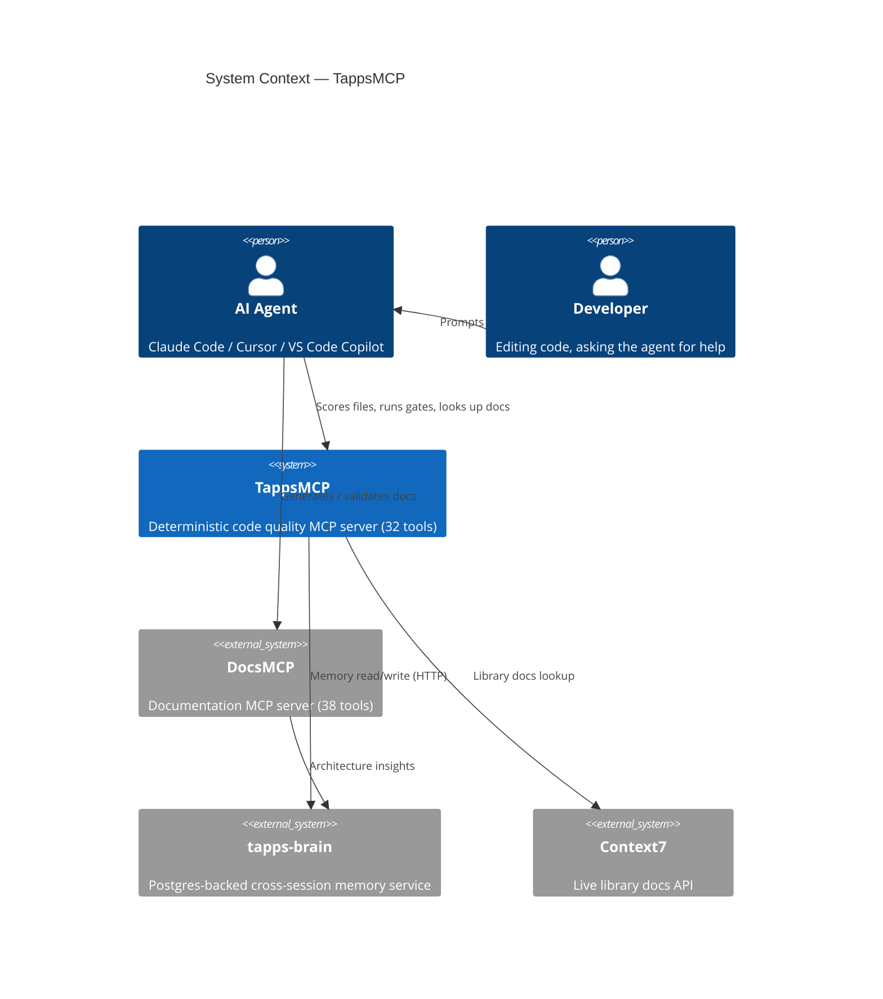
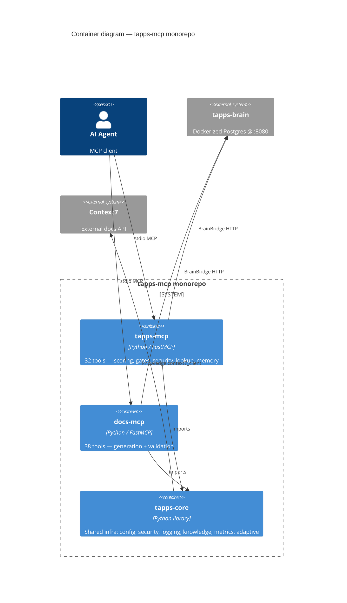
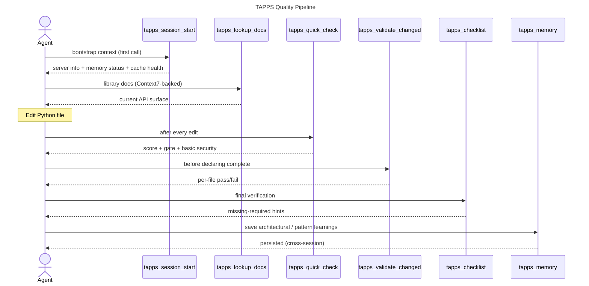

# TappsMCP Diagrams

Auto-generated from source by `docs-mcp`. All diagrams render natively on GitHub.

To regenerate: see [Regeneration](#regeneration) at the bottom.

| File | Type | Generator |
|---|---|---|
| [01-c4-context.md](01-c4-context.md) | C4 System Context | `docs_generate_diagram(diagram_type="c4_context")` |
| [02-c4-container.md](02-c4-container.md) | C4 Container | `docs_generate_diagram(diagram_type="c4_container")` |
| [03-module-map.md](03-module-map.md) | Module map (top-level) | `docs_generate_diagram(diagram_type="module_map")` |
| [04-pattern-card.md](04-pattern-card.md) | Architectural archetype | `docs_generate_diagram(diagram_type="pattern_card")` |
| [05-c4-component-tapps-mcp.md](05-c4-component-tapps-mcp.md) | C4 Component (tapps-mcp) | `docs_generate_diagram(diagram_type="c4_component", scope="packages/tapps-mcp/src/tapps_mcp")` |
| [06-c4-component-docs-mcp.md](06-c4-component-docs-mcp.md) | C4 Component (docs-mcp) | `docs_generate_diagram(diagram_type="c4_component", scope="packages/docs-mcp/src/docs_mcp")` |
| [07-er-output-schemas.md](07-er-output-schemas.md) | ER diagram (output schemas) | `docs_generate_diagram(diagram_type="er_diagram", scope=".../common/output_schemas.py")` |
| [08-sequence-quality-pipeline.md](08-sequence-quality-pipeline.md) | Quality pipeline sequence | `docs_generate_diagram(diagram_type="sequence", flow_spec=...)` |
| [interactive.html](interactive.html) | Pan/zoom HTML | `docs_generate_interactive_diagrams(...)` |

## At a glance

### System context



### Container view



## Quality pipeline flow



## Regeneration

```bash
# Full report (HTML, embedded SVGs)
docs_generate_architecture(output_path="docs/ARCHITECTURE.html", motion="subtle")

# Interactive (Mermaid.js with pan/zoom)
docs_generate_interactive_diagrams(
    diagram_types="dependency,module_map,c4_component,c4_container,c4_context,er_diagram",
    output_path="docs/diagrams/interactive.html",
    motion="subtle",
)

# Standalone diagrams — see the per-file headers for the exact call.
```

Pin diagram regeneration to: every minor version bump, every refactor of `server*.py`, every package add/remove.
